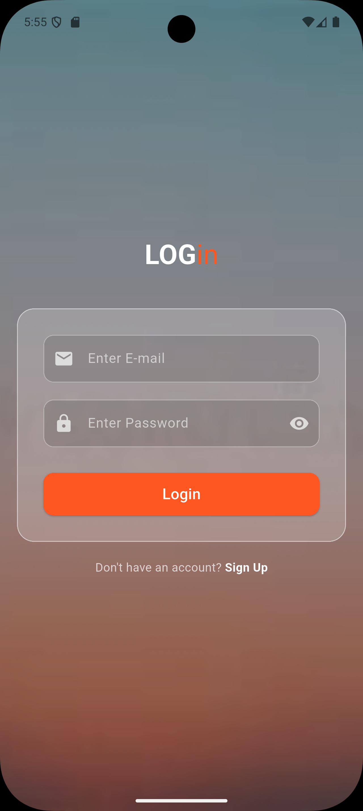

# 🔐 Modern Glassmorphism Login UI

A visually stunning Login Interface built with **Flutter**, featuring a modern "Glassmorphism" effect, responsive design, and interactive state management. This project demonstrates high-fidelity UI implementation with background handling, input validation, and secure password toggling.

---

### 📸 App Interface

| **Login Screen** |
|:---:|
|  |
| *Frosted glass effect with full-screen background* |

---

### 🛠️ Tech Stack

*  **Flutter Framework**
*  **Dart Language**
* **Material 3 Design**

---

### ✨ Key Features

* **Glassmorphism Effect:** Uses semi-transparent containers with border styling to create a frosted glass look over a background image.
* **Responsive Layout:** Built with `Stack`, `Center`, and `SingleChildScrollView` to ensure the UI looks perfect on all screen sizes and prevents pixel overflow when the keyboard opens.
* **Interactive Password Field:** Includes a "Show/Hide" toggle feature for the password input using `setState`.
* **Full-Screen Background:** Utilizes `BoxDecoration` with `BoxFit.cover` to ensure the background image scales correctly behind the UI.
* **Modern Input Styling:** Custom-styled text fields with white borders and distinct focus states.

---

### 🚀 How to Run Locally

1.  **Clone the repository**
    ```bash
    git clone [https://github.com/saadullah-001/LoginPage-UI.git](https://github.com/saadullah-001/LoginPage-UI.git)
    ```

2.  **Navigate to the project directory**
    ```bash
    cd login-page-ui
    ```

3.  **Install dependencies**
    ```bash
    flutter pub get
    ```

4.  **Run the app**
    ```bash
    flutter run
    ```

---

### 👤 Author

**Muhammad SaadUllah**
- [GitHub Profile](https://github.com/saadullah-001)
